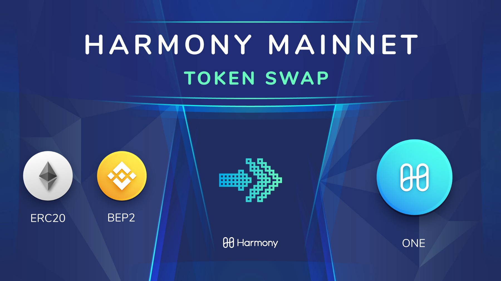

# Binance

## [BEP2 Tokens](https://github.com/binance-chain/BEPs/blob/master/BEP2.md#bep-2-tokens-on-binance-chain) 

The Harmony token $ONE was officially brought into the world on Binance Chain as a BEP2 token on May 28th coinciding with the launch of Mainnet Phase 1. This was supported with a major push from Binance to bring new projects into its eco-system via the decentralized Binance DEX. Sharding is still in its infancy and we prioritized building our pool of external validators gradually to ensure security and up-time before migrating the BEP2 tokens to full mainnet.

## Binance Launchpad:  

### [HARMONY \(ONE\) Binance Research Report](https://medium.com/harmony-one/harmony-one-e35a9dcf6ebd) 

##  

## For US Token Holders 

As of September 12 2019 US based token holders will no longer be able to deposit funds or make trades on Binance.com. As stated by the exchange "Binance is unable to provide services to any U.S. person".

As a Launchpad project Binance was our first exchange and continues to be the primary platform for those wishing to purchase our token. BAM Trading Services has announced that it will be partnering with Binance to launch Binance.US which will provide secure and reliable cryptocurrency trading to users in the United States.

Harmony is not currently listed on Binance.US but we are now listed on Kucoin so US token holders now have more options available to them.

