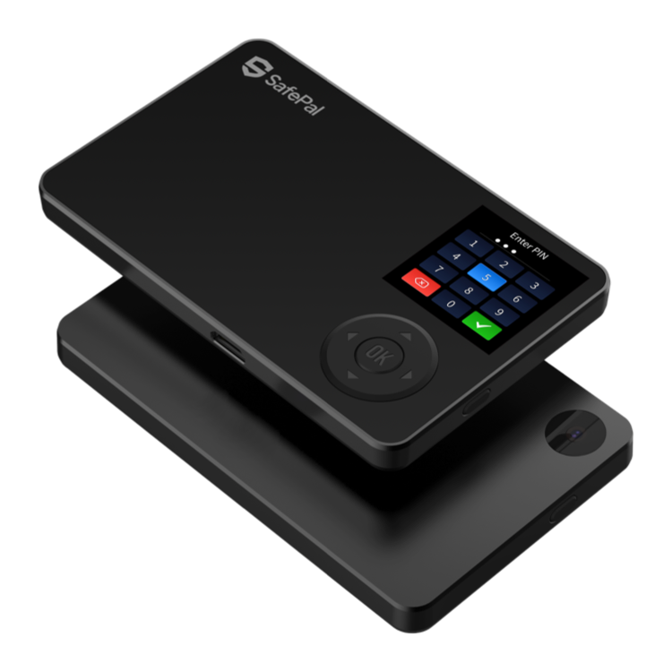

# Safepal

## **SafePal Hardware Wallet**

SafePal is a secure and user-friendly hardware wallet designed for the masses. SafePal S1, its first flagship hardware wallet, adopts multiple layers of security schemes and intuitive user interfaces, enabling users to store, transfer and trade coins in the wallet in the easiest way.

## **Important Disclaimer**

While our network currently consists of 4 shards and supports cross-shard transactions, **all activity with our partner exchanges will be limited to shard 0 for simplicity**. This means that when you’re sending ONE tokens to an exchange wallet, you **must send it to shard 0 of the exchange wallet address.** Note, your ONE wallet address remains the same for each shard, but you can additionally specify which shard out of the four shards would you like to send the ONE tokens to. For your ONE wallet on a centralized exchange, if you don’t receive ONE tokens on shard 0, then your funds will not be lost but you will need to contact the exchange in order to access them. You may choose to store your funds on any shard in any of the non-custodial wallets mentioned above that support cross-shard experience.

