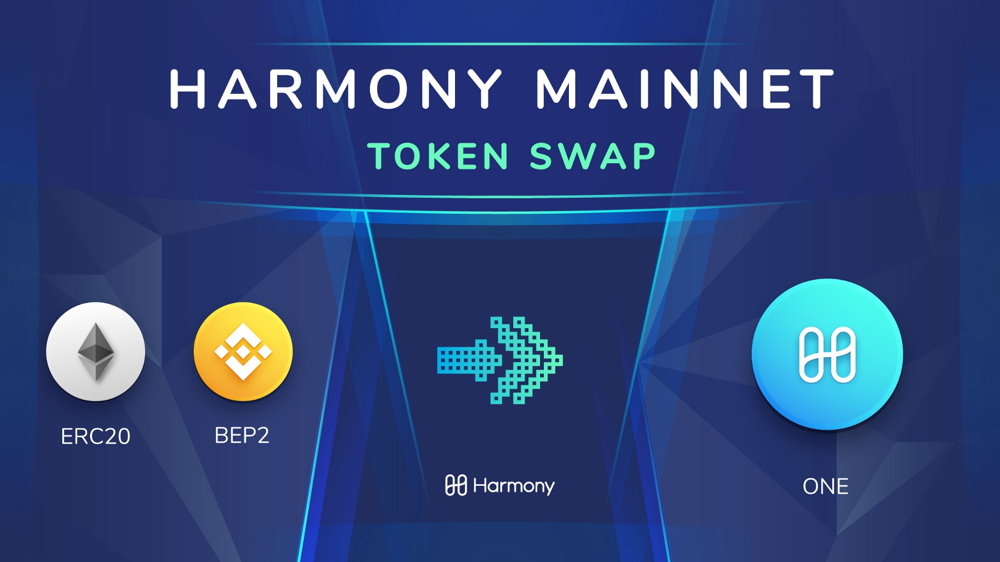

# Getting Native ONE tokens


ToDo:

* add references for all exchanges
* add buying guide
* 


### Buying ONE

In order to stake with Harmony, you need to have native ONE tokens. 

## Store Native ONE 

## Where can I buy Harmony ONE tokens? 

* ​[Binance](https://harmony.one/binance) online exchange \(non-U.S. citizens\)
* ​[Bitmax](https://bitmax.io/#/home) online exchange
* ​[Kucoin](https://www.kucoin.com/) online exchange
* ​[Gate.io](https://www.gate.io/) online exchange
* ​[TrustWallet](https://harmony.one/wallet) with credit cards
* ​[Crypto.com](https://harmony.one/card) with credit cards
* ​[Bitladon \(EUR\)](https://www.bitladon.com/coins) online exchange
* ​[Coinmerce \(EUR\)](https://coinmerce.io/uk/buy/one/) online exchange
* ​[Coinspot \(AUD\)](https://twitter.com/coinspotau/status/1145869420151001088?s=20) online exchange

## For US Token Holders 

As of September 12 2019 US based token holders will no longer be able to deposit funds or make trades on Binance.com. As stated by the exchange "Binance is unable to provide services to any U.S. person".

As a Launchpad project Binance was our first exchange and continues to be the primary platform for those wishing to purchase our token. BAM Trading Services has announced that it will be partnering with Binance to launch Binance.US which will provide secure and reliable cryptocurrency trading to users in the United States.

Harmony is not currently listed on Binance.US but we are now listed on Kucoin so US token holders now have more options available to them.

## Coinbase 

August 5th 2019 Coinbase [announced](https://blog.coinbase.com/coinbase-continues-to-explore-support-for-new-digital-assets-4d2ecbcbd38c) it was exploring the addition of 8 new assets to its exchange. Harmony was listed as one of those assets. Coinbase's goal is to offer support for all assets that meet our technical standards and which comply with applicable laws.

## **What’s the purpose of Harmony’s native token?** 

The Harmony token is a protocol token used for a number of purposes on the network.

1. The token is used to stake in order to become a validator on the network to earn block rewards and transaction fees. We use Proof of Stake \(POS\) as our sybil resistance mechanism in the protocol.

2. The token is used to pay fees on the network, both transaction fees, gas and storage fees.

3. The token is used in voting for on-chain governance of the protocol. Without the token, the protocol could not function.

